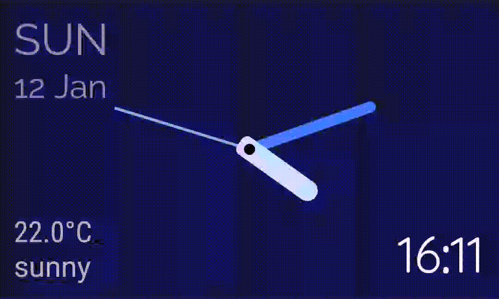
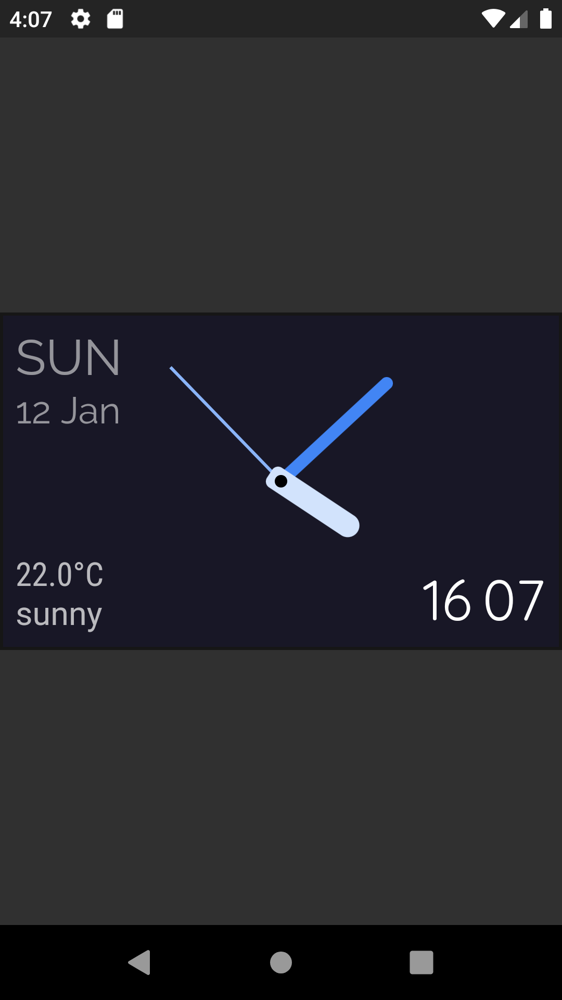
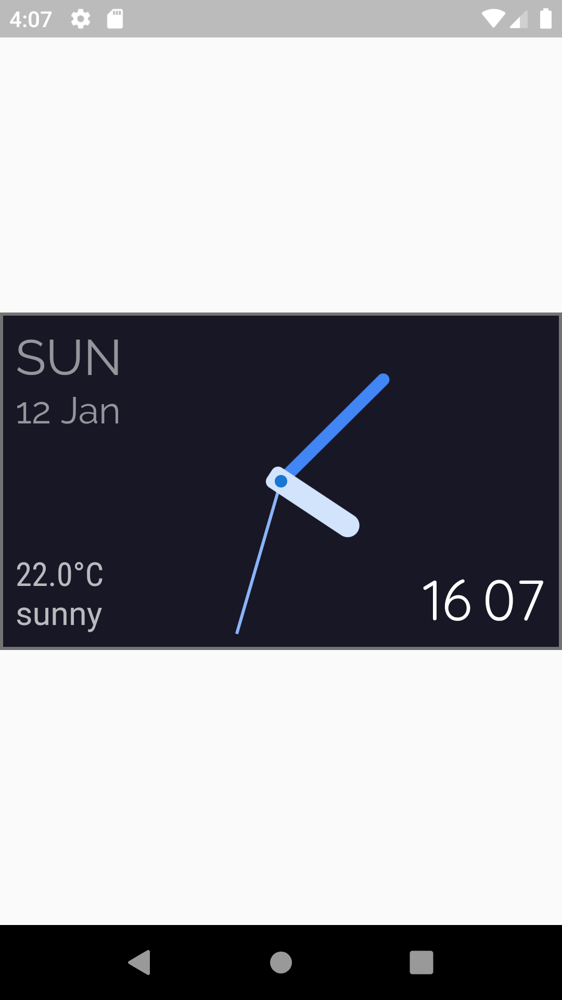

# Analog Clock

## Documentation
This is a Modern (Analog & Digital) Clock made with Flutter for Flutter Clock contest.

It both shows the Analog and Digital Clock view in single app.
It has a light theme and a dark theme, and displays sample weather and location data.

NB: This Flutter Clock need package from <b>flutter_clock_helper</b>. Please refer to the attached zip file 

Feature Video:

Screenshots:

